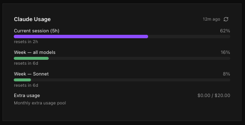
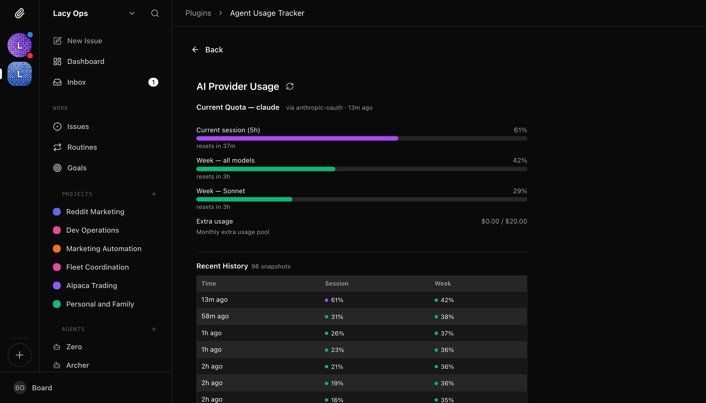
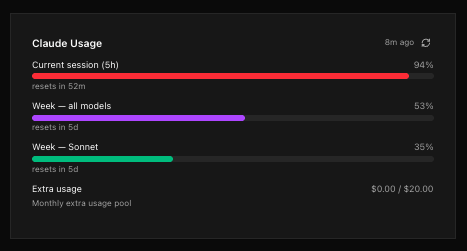
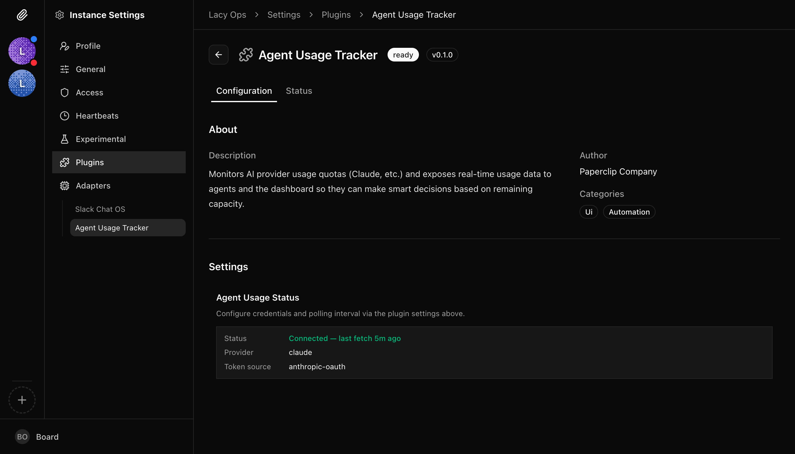

# paperclip-plugin-agent-usage

A [Paperclip](https://docs.paperclip.ing) plugin that tracks AI provider usage quotas and exposes real-time data to agents and the dashboard.



## Features

- **Dashboard widget** — shows current Claude usage (session, weekly, per-model) with color-coded bars
- **Full usage page** — detailed view with usage history table
- **Agent tools** — `get-usage` and `get-usage-summary` let agents check remaining capacity before expensive operations
- **Scheduled polling** — fetches usage every 15 minutes (configurable)
- **Auto-detection** — reads Claude OAuth token from local credentials or macOS Keychain
- **Reset times** — shows when each quota window resets

## Supported Providers

- **Claude** (Anthropic) — via OAuth usage API or CLI fallback

More providers planned.

## Installation

Install into your Paperclip instance via the Plugin Manager UI or REST API:

```bash
# From local path (development)
POST /api/plugins/install
{ "packageName": "/path/to/paperclip-plugin-agent-usage", "isLocalPath": true }

# From npm (when published)
POST /api/plugins/install
{ "packageName": "paperclip-plugin-agent-usage" }
```

## Screenshots

### Usage Page

Detailed view with per-model quota bars, reset times, and usage history.



### Color-Coded Quota Bars

Bars change color as usage increases — green, purple, and red — so you can spot limits at a glance.



### Plugin Settings

Auto-detects your Claude OAuth credentials and shows connection status.



## Configuration

| Field | Description | Default |
|-------|-------------|---------|
| `pollIntervalMinutes` | How often to refresh usage data | `15` |
| `providers` | Which providers to track | `["claude"]` |

OAuth credentials are auto-detected from your local Claude installation (`~/.claude` credentials or macOS Keychain). Token lifecycle is managed by Paperclip.

## Development

```bash
npm install
npm run build
npm run typecheck
```

## Agent Tools

### `get-usage`

Returns raw usage quota data (JSON) for a provider. Agents call this to decide whether to proceed with expensive operations.

### `get-usage-summary`

Returns a human-readable summary of remaining capacity across all providers, including reset times.

## License

MIT
